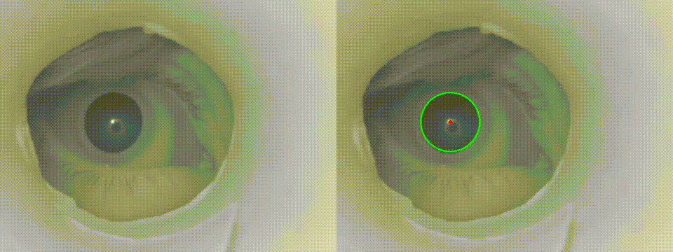
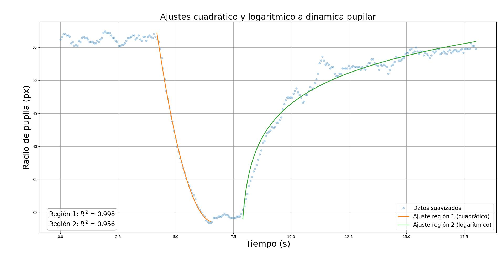

# 👁️ Pupil Detection using Hough Circle Transform
Pupil detection using classical computer vision (Hough Circle Transform).

This repository contains an **algorithmic approach for pupil detection** using classical Computer Vision techniques, specifically the **Hough Circle Transform**.

## 🧠 Approach

Pipeline:
1. Grayscale + normalization
2. Noise reduction (Gaussian blur)
3. Edge/gradient-based circle proposal (Hough)
4. Candidate selection (best circle)
5. Visualization + basic validation

## 🎞️ Demo

<p align="center">
  
</p>


<p align="center">
  
</p>


## 🛠️ Tech
- Python
- OpenCV
- NumPy

## 🚀 Quickstart

```bash
pip install -r requirements.txt
